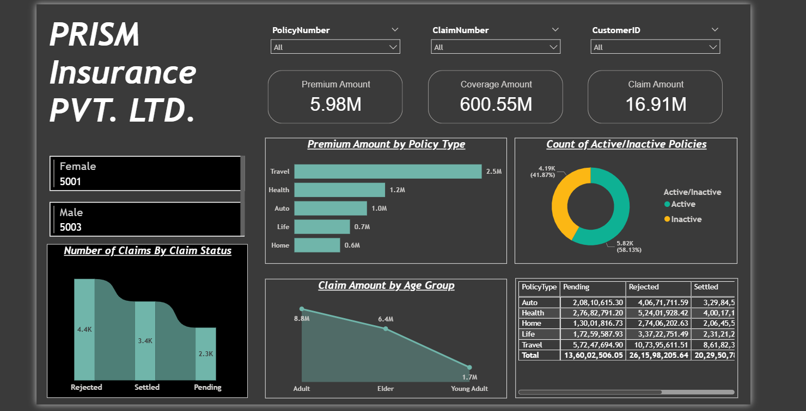

# 📈 Insurance Portfolio & Customer Sentiment Analysis (Python/NLP & Power BI)

## 📌 Project Overview

This project focuses on a comprehensive analysis of an insurance company's portfolio performance and **customer feedback**. Utilizing **Power BI** and **Natural Language Processing (NLP) / AI techniques**, I transformed raw transactional and textual data into actionable insights for strategic decision-making, particularly concerning policy renewals, claim patterns, and **customer risk/satisfaction**.

## 🎯 Key Objectives

1.  **Customer Sentiment Analysis:** Apply NLP techniques to customer feedback to quantify sentiment (Positive, Negative, Neutral) and identify key themes driving dissatisfaction.
2.  **Portfolio Performance:** Analyze key metrics like Premium Amount, Coverage Amount, and Claim Ratios across different policy types (Auto, Health, Life, Travel).
3.  **Claim Management:** Evaluate the efficiency of the claim process by analyzing Claim Status, Claim Amounts, and settlement rates.
4.  **Interactive Visualization:** Develop a dynamic and intuitive Power BI dashboard that enables drill-down analysis for business users.

---

## 🛠️ Tools & Technologies

| Category | Tool | Purpose |
| :---: | :--- | :--- |
| **Data Analysis & BI** | **Power BI** | Data cleaning, modeling (DAX), and interactive visualization. |
| **Advanced Techniques** | **NLP / Text Analysis** | Processing customer feedback to derive measurable sentiment scores. |
| **Data Source** | **CSV** (`01_Policy_Data.csv` and `02_Customer_Feedback_Data.csv`) | Source of transactional and customer text data. |
| **Analysis Focus** | **DAX** (Data Analysis Expressions) | Creating custom measures (e.g., Claim Ratio, Average Premium). |

---

## 📊 Dashboard Highlights

The Power BI dashboard provides a single source of truth for the insurance portfolio. Below are screenshots illustrating the key views and insights.

### 1. Overall Portfolio Performance & Sentiment Score
*This view summarizes total revenue, coverage, and claim metrics, alongside the aggregated Customer Sentiment Index.*

### 2. Policy and Claim Breakdown
*This visualization allows users to filter performance by Policy Type and visualize the Claim Status distribution.*

### 3. Customer Demographic Analysis
*This chart helps identify age and gender segments associated with different risk profiles.*

---

## 📂 Repository Contents

| File | Description |
| :--- | :--- |
| `01_Policy_Data.csv` | The raw, anonymized transactional policy and claim data. |
| **`02_Customer_Feedback_Data.csv`** | **The raw text data used for Sentiment Analysis (NLP).** |
| `Insurance_BI_Report_Template.pbit` | The Power BI Report Template file, which includes the data model, measures (DAX), and complete dashboard layout. |
| `03_Portfolio_Performance.png`, etc. | Images showcasing the final dashboard design and key findings. |

---

## 💡 Key Findings

* **[Insert a key finding here, e.g.]** The **Health** policy segment shows the highest Claim Ratio, indicating a potential need for premium adjustments or a review of coverage limits in this category.
* **[Insert a second key finding here, e.g.]** Claims submitted by customers over **65 years of age** have a longer average 'Pending' duration, suggesting a bottleneck in the manual review process for high-age policies.
